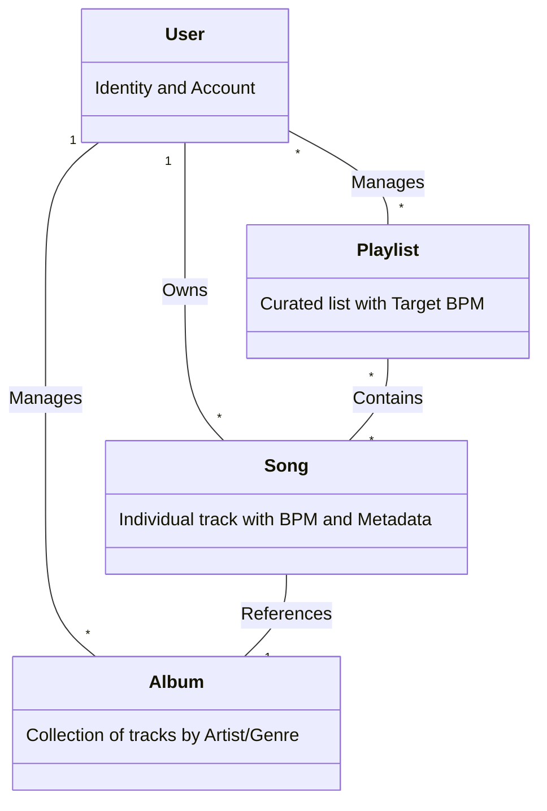

# Radio DJ — CS321 Design Diagrams - Greeshma

---

## Detailed Class Diagram

```mermaid
classDiagram
    direction TB
    User "1" -- "*" Song : Owns
    User "1" -- "*" Album : Manages
    User "*" -- "*" Playlist : Manages
    Playlist "*" -- "*" Song : Contains
    Song -- "1" Album : References

    class User {
        Identity and Account
    }
    class Song {
        Individual track with BPM and Metadata
    }
    class Album {
        Collection of tracks by Artist/Genre
    }
    class Playlist {
        Curated list with Target BPM
    }

```