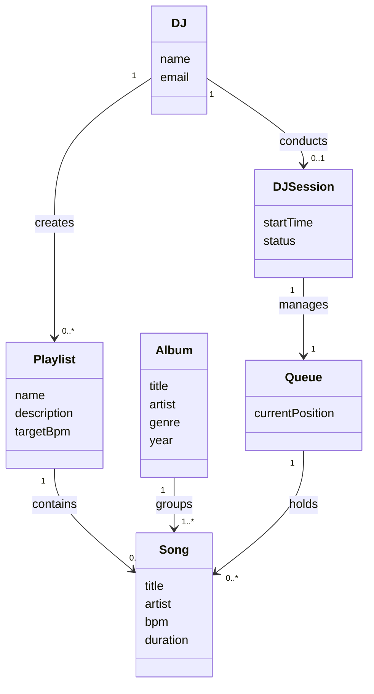
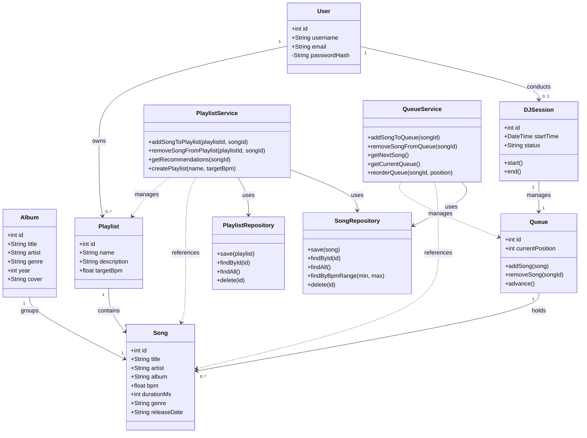
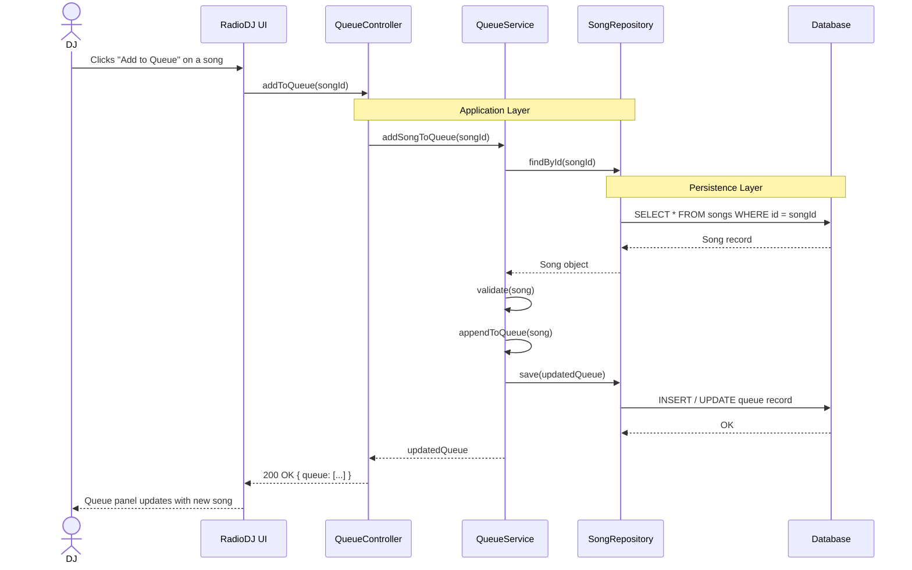
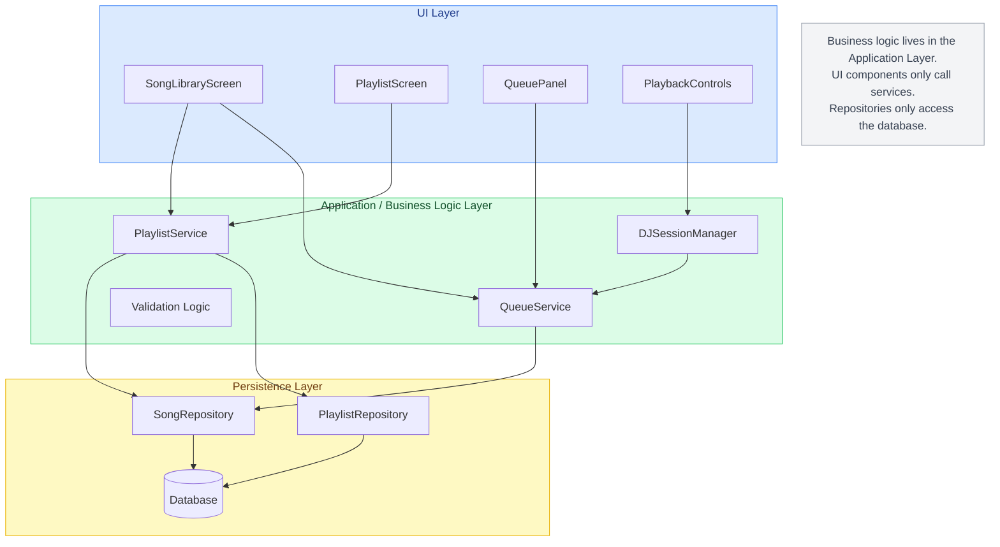

# Radio DJ — CS321 Design Diagrams

---

## Diagram 1: Conceptual Class Diagram

---

## Diagram 2: Detailed Class Diagram

---

## Diagram 3: Sequence Diagram — Add Song to Queue

---

## Diagram 4: Layered Architecture Diagram

